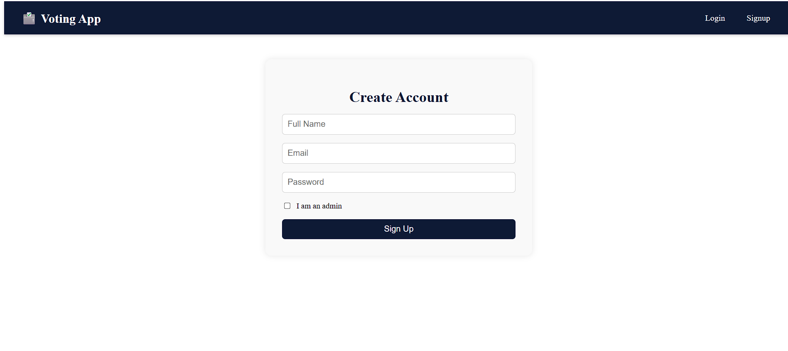
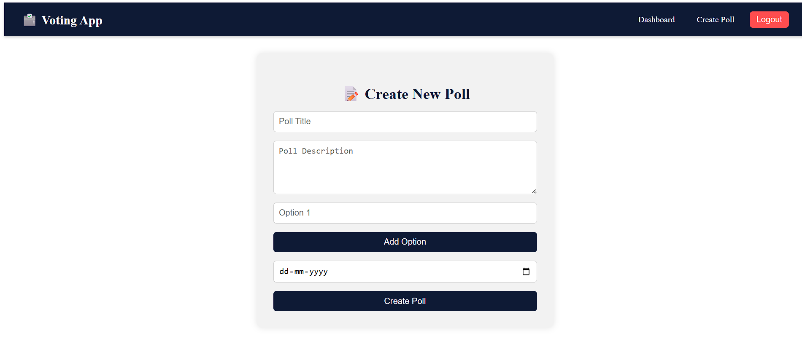
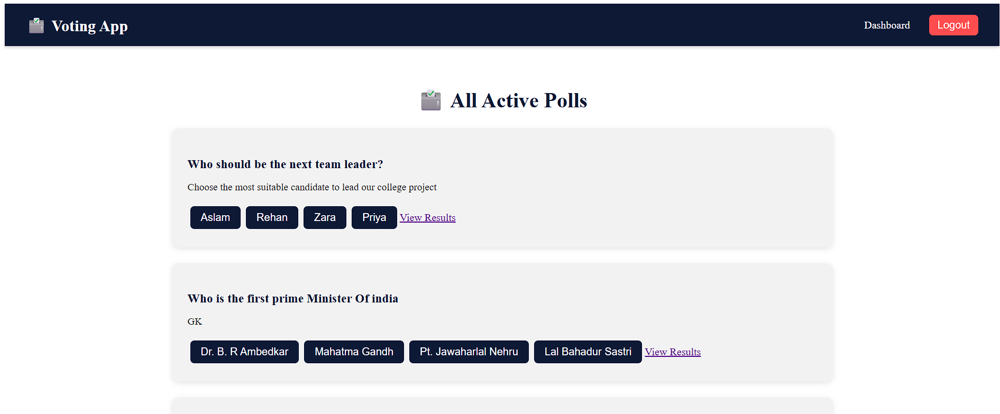

# 🗳️ Online Voting System (MERN Stack)

This is a **full-stack Online Voting System** built using the **MERN stack (MongoDB, Express, React, Node.js)**.  
The system allows **secure user authentication, poll creation, voting, and result display** with role-based access for **Admin and Users**.

---

## 🚀 Features

- 🔐 **User Authentication** (Signup/Login with JWT)  
- 👤 **Role-based Access** (Admin & User)  
- 📝 **Admin Dashboard** – Create and manage polls  
- 🗳️ **Voting System** – Users can vote only once per poll  
- 📊 **Real-time Results** – Display poll results dynamically  
- 📱 **Responsive Frontend** – Built with React & CSS Modules  
- 🛡️ **Secure APIs** – Protected backend routes with JWT  

---

## 🛠️ Tech Stack

**Frontend:**
- React.js  
- React Router  
- CSS Modules / Tailwind CSS  

**Backend:**
- Node.js  
- Express.js  
- MongoDB with Mongoose  

**Authentication:**
- JWT (JSON Web Token)  

---


## ⚡ Installation & Setup

1. **Clone the repo**
   ```bash
   git clone https://github.com/AslamKhanpathan142/online-voting-system-with-mern-stack.git
   cd online-voting-system-with-mern-stack

---

## ⚡Setup environment variables
 1. **Create a .env file inside Voting-server and add:**
  ```bash
  PORT=5000
  MONGO_URL=your_mongodb_connection_string
  JWT_SECRET=your_secret_key
  ```

---
## 🚀 Live Demo  

Check out the live version of the project here:  

👉 [Live Demo:- My Website](https://online-voting-system-with-mern-stac.vercel.app)  

---

## 📸 Screenshots  

### 🔐 Signup Page  
  

### 🏠 Create Poll 
  

### 🗳️ Poll Page  
  
 


